4Th
================
Kalyani Cauwenberghs
10/24/2019

K-Means Clustering
------------------

``` r
#generate some example data for clustering
tmp <- c(rnorm(30,-3), rnorm(30,3))
x <- cbind(x=tmp, y=rev(tmp))
plot(x)
```

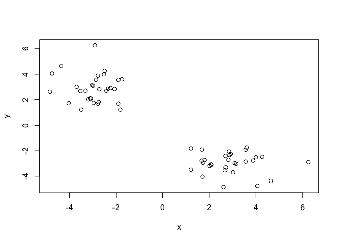

``` r
#run kmeans function
k<-kmeans(x, centers=2, iter.max = 10, nstart = 20,
       algorithm = c("Hartigan-Wong", "Lloyd", "Forgy",
                     "MacQueen"), trace=FALSE)
k
```

    ## K-means clustering with 2 clusters of sizes 30, 30
    ## 
    ## Cluster means:
    ##           x         y
    ## 1 -2.950110  2.878486
    ## 2  2.878486 -2.950110
    ## 
    ## Clustering vector:
    ##  [1] 1 1 1 1 1 1 1 1 1 1 1 1 1 1 1 1 1 1 1 1 1 1 1 1 1 1 1 1 1 1 2 2 2 2 2 2 2 2
    ## [39] 2 2 2 2 2 2 2 2 2 2 2 2 2 2 2 2 2 2 2 2 2 2
    ## 
    ## Within cluster sum of squares by cluster:
    ## [1] 54.88815 54.88815
    ##  (between_SS / total_SS =  90.3 %)
    ## 
    ## Available components:
    ## 
    ## [1] "cluster"      "centers"      "totss"        "withinss"     "tot.withinss"
    ## [6] "betweenss"    "size"         "iter"         "ifault"

Q. How many points are in each cluster? A. 30

Q. What ‘component’ of your result object details - cluster size?

``` r
k$size
```

    ## [1] 30 30

-   cluster assignment/membership?

``` r
k$cluster
```

    ##  [1] 1 1 1 1 1 1 1 1 1 1 1 1 1 1 1 1 1 1 1 1 1 1 1 1 1 1 1 1 1 1 2 2 2 2 2 2 2 2
    ## [39] 2 2 2 2 2 2 2 2 2 2 2 2 2 2 2 2 2 2 2 2 2 2

-   cluster center?

``` r
k$centers
```

    ##           x         y
    ## 1 -2.950110  2.878486
    ## 2  2.878486 -2.950110

Plot x colored by the kmeans cluster assignment and add cluster centers as blue points

``` r
#plot color categorized points
plot(x,col=k$cluster)
#plot centers in blue
points(k$centers,col="blue",pch=15)
```

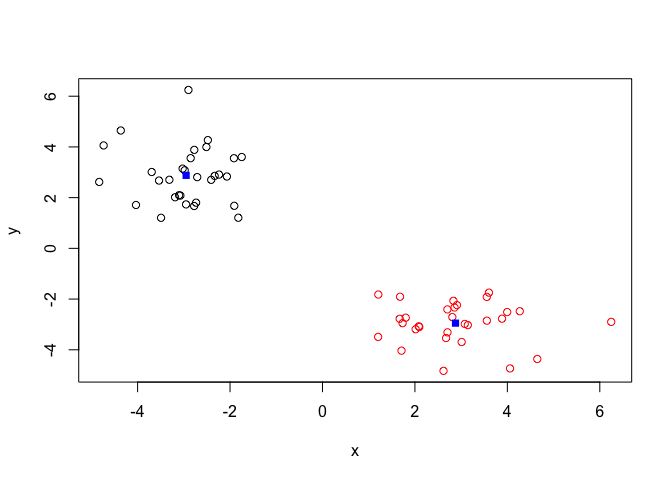

Hierarchical Clustering
-----------------------

``` r
# First we need to calculate Euclidean distance between observations
dist_matrix <- dist(x)
hc <- hclust(d = dist_matrix)
# the print method is not so useful here
hc
```

    ## 
    ## Call:
    ## hclust(d = dist_matrix)
    ## 
    ## Cluster method   : complete 
    ## Distance         : euclidean 
    ## Number of objects: 60

``` r
plot(hc)
#draw a horizontal line across the branch you want to cut
abline(h=6,col="red")
```

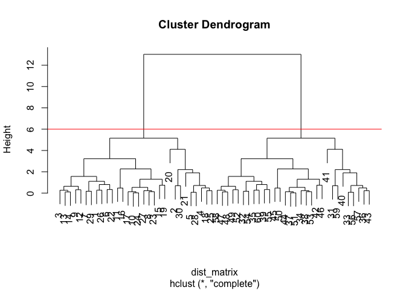

``` r
#cut tree according to height
clusters1<-cutree(hc,h=6)
clusters1
```

    ##  [1] 1 1 1 1 1 1 1 1 1 1 1 1 1 1 1 1 1 1 1 1 1 1 1 1 1 1 1 1 1 1 2 2 2 2 2 2 2 2
    ## [39] 2 2 2 2 2 2 2 2 2 2 2 2 2 2 2 2 2 2 2 2 2 2

``` r
#cut tree according to #clusters
clusters2<-cutree(hc,k=2)
clusters2
```

    ##  [1] 1 1 1 1 1 1 1 1 1 1 1 1 1 1 1 1 1 1 1 1 1 1 1 1 1 1 1 1 1 1 2 2 2 2 2 2 2 2
    ## [39] 2 2 2 2 2 2 2 2 2 2 2 2 2 2 2 2 2 2 2 2 2 2

Make another data set to analyze with Hierarchical Clustering

``` r
# Step 1. Generate some example data for clustering
x <- rbind(
 matrix(rnorm(100, mean=0, sd = 0.3), ncol = 2), # c1
 matrix(rnorm(100, mean = 1, sd = 0.3), ncol = 2), # c2
 matrix(c(rnorm(50, mean = 1, sd = 0.3), # c3
 rnorm(50, mean = 0, sd = 0.3)), ncol = 2))
colnames(x) <- c("x", "y")
# Step 2. Plot the data without clustering
plot(x)
```

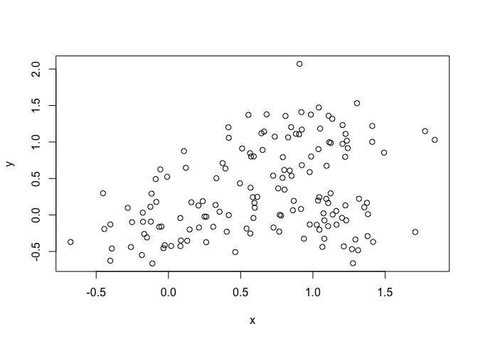

``` r
# Step 3. Generate colors for known clusters
# (just so we can compare to hclust results)
col <- as.factor( rep(c("c1","c2","c3"), each=50) )
plot(x, col=col)
```

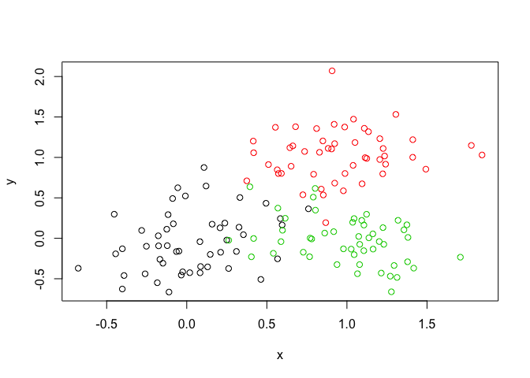

Q. Use the dist(), hclust(), plot() and cutree() functions to return 2 and 3 clusters Q. How does this compare to your known 'col' groups?

``` r
# Step 4. Cluster the data with Hierarchical Clustering
dist_matrix <- dist(x)
hc <- hclust(d = dist_matrix)
plot(hc)
```

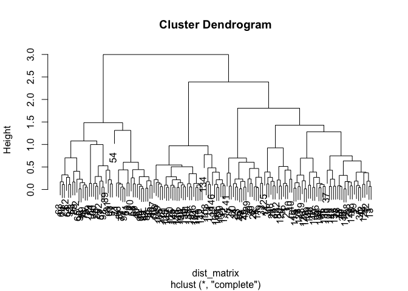

``` r
# separate into 2 clusters
clusters2<-cutree(hc,k=2)
clusters2
```

    ##   [1] 1 1 1 1 1 1 1 1 1 1 1 1 1 1 1 1 1 1 1 1 1 1 1 1 1 1 1 1 1 1 1 1 1 1 1 1 1
    ##  [38] 1 1 1 1 1 1 1 1 1 1 1 1 1 2 2 2 2 2 1 2 2 2 2 2 2 2 2 2 2 2 2 2 2 2 2 2 2
    ##  [75] 2 2 2 2 2 2 2 2 2 2 1 1 2 2 2 2 2 2 2 1 2 2 2 2 1 2 1 1 1 1 1 1 1 1 1 1 1
    ## [112] 1 1 1 1 1 1 1 1 1 1 1 1 1 1 1 1 1 1 1 1 1 1 1 1 1 1 1 1 1 1 1 1 1 1 1 1 1
    ## [149] 1 1

``` r
plot(x,col=clusters2)
```

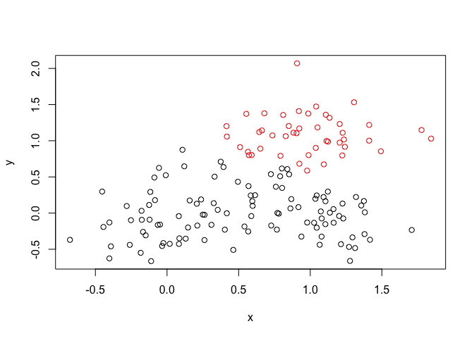

``` r
table(clusters2)
```

    ## clusters2
    ##   1   2 
    ## 105  45

``` r
#cross tabulate with known
table(clusters2,col)
```

    ##          col
    ## clusters2 c1 c2 c3
    ##         1 50  5 50
    ##         2  0 45  0

``` r
# separate into 3 clusters
clusters3<-cutree(hc,k=3)
clusters3
```

    ##   [1] 1 1 1 1 1 1 1 1 1 1 1 1 1 1 1 1 1 1 1 1 1 1 1 1 1 1 1 1 1 1 1 1 1 1 1 1 1
    ##  [38] 1 1 1 1 1 1 1 1 1 1 1 1 1 2 2 2 2 2 1 2 2 2 2 2 2 2 2 2 2 2 2 2 2 2 2 2 2
    ##  [75] 2 2 2 2 2 2 2 2 2 2 1 1 2 2 2 2 2 2 2 3 2 2 2 2 1 2 3 3 3 1 3 3 3 3 1 3 3
    ## [112] 3 3 1 3 1 3 1 3 1 3 3 1 1 3 3 1 3 3 3 3 3 3 3 1 3 3 1 1 1 3 3 1 3 1 3 3 1
    ## [149] 3 3

``` r
plot(x,col=clusters3)
```

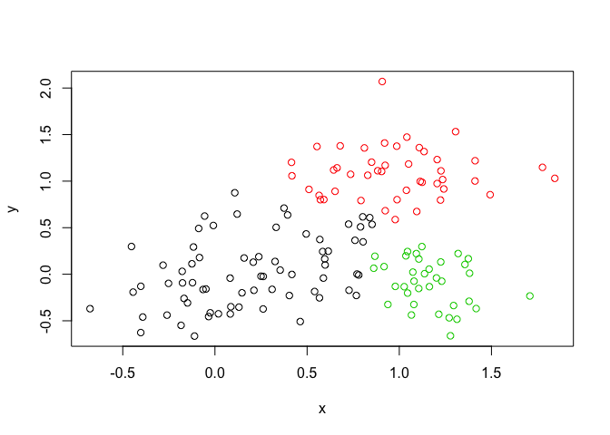

``` r
table(clusters3)
```

    ## clusters3
    ##  1  2  3 
    ## 70 45 35

``` r
#cross tabulate with known
table(clusters3,col)
```

    ##          col
    ## clusters3 c1 c2 c3
    ##         1 50  4 16
    ##         2  0 45  0
    ##         3  0  1 34

Principal Component Analysis
----------------------------

``` r
#sample gene expression data
mydata <- read.csv("https://tinyurl.com/expression-CSV",
 row.names=1) 
head(mydata)
```

    ##        wt1 wt2  wt3  wt4 wt5 ko1 ko2 ko3 ko4 ko5
    ## gene1  439 458  408  429 420  90  88  86  90  93
    ## gene2  219 200  204  210 187 427 423 434 433 426
    ## gene3 1006 989 1030 1017 973 252 237 238 226 210
    ## gene4  783 792  829  856 760 849 856 835 885 894
    ## gene5  181 249  204  244 225 277 305 272 270 279
    ## gene6  460 502  491  491 493 612 594 577 618 638

How many genes are in the dataset?

``` r
dim(mydata)
```

    ## [1] 100  10

Run PCA

``` r
# we want genes as columns, samples as rows for prcomp
pca <- prcomp(t(mydata), scale=TRUE) 
## See what is returned by the prcomp() function
attributes(pca)
```

    ## $names
    ## [1] "sdev"     "rotation" "center"   "scale"    "x"       
    ## 
    ## $class
    ## [1] "prcomp"

``` r
## A basic PC1 vs PC2 2-D plot
plot(pca$x[,1], pca$x[,2])
```


Make a scree plot

``` r
## Precent variance is often more informative to look at
pca.var <- pca$sdev^2
# second argument is #places after decimals to round
pca.var.per <- round(pca.var/sum(pca.var)*100, 4)
pca.var.per
```

    ##  [1] 92.6163  2.3099  1.1191  1.1068  0.7755  0.6814  0.6418  0.3852  0.3641
    ## [10]  0.0000

``` r
#make a scree plot
barplot(pca.var.per, main="Scree Plot",
 xlab="Principal Component", ylab="Percent Variation")
```

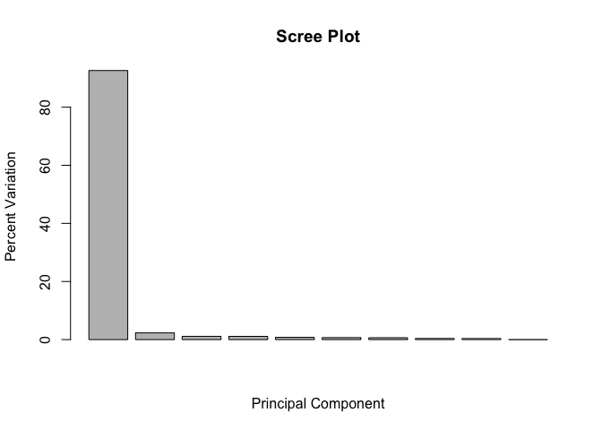 Make a color coded PCA plot

``` r
## A vector of colors for wt and ko samples
colvec <- colnames(mydata)
colvec[grep("wt", colvec)] <- "red"
colvec[grep("ko", colvec)] <- "blue"
plot(pca$x[,1], pca$x[,2], col=colvec, pch=16,
 xlab=paste0("PC1 (", pca.var.per[1], "%)"),
 ylab=paste0("PC2 (", pca.var.per[2], "%)")) 
```

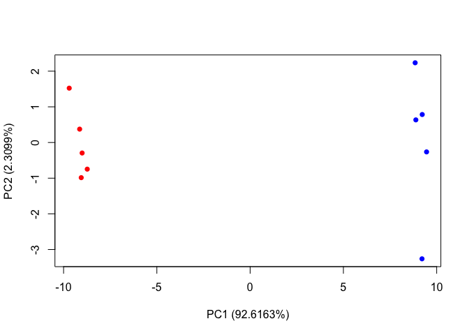 Another version of above code

``` r
plot(pca$x[,1],pca$x[,2], col=c("red","red","red","red","red","blue","blue","blue","blue","blue"))
```

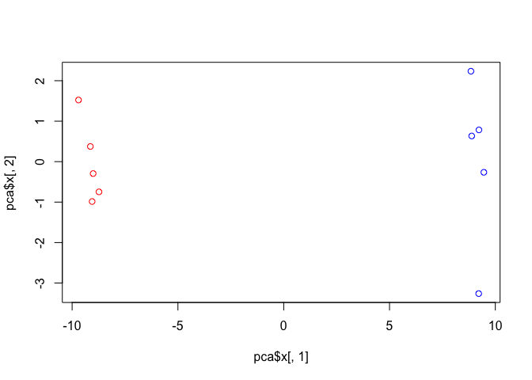

### LAB: PCA for UK food data

``` r
x <- read.csv("UK_foods.csv")
head(x)
```

    ##                X England Wales Scotland N.Ireland
    ## 1         Cheese     105   103      103        66
    ## 2  Carcass_meat      245   227      242       267
    ## 3    Other_meat      685   803      750       586
    ## 4           Fish     147   160      122        93
    ## 5 Fats_and_oils      193   235      184       209
    ## 6         Sugars     156   175      147       139

Q1. How many rows and columns are in your new data frame named x? What R functions could you use to answer this questions?

``` r
dim(x)
```

    ## [1] 17  5

``` r
#get rid of left hand column
rownames(x) <- x[,1]
x <- x[,-1]
head(x)
```

    ##                England Wales Scotland N.Ireland
    ## Cheese             105   103      103        66
    ## Carcass_meat       245   227      242       267
    ## Other_meat         685   803      750       586
    ## Fish               147   160      122        93
    ## Fats_and_oils      193   235      184       209
    ## Sugars             156   175      147       139

``` r
dim(x)
```

    ## [1] 17  4

``` r
#shorter way of making the data frame without the left column
x <- read.csv("UK_foods.csv", row.names=1)
head(x)
```

    ##                England Wales Scotland N.Ireland
    ## Cheese             105   103      103        66
    ## Carcass_meat       245   227      242       267
    ## Other_meat         685   803      750       586
    ## Fish               147   160      122        93
    ## Fats_and_oils      193   235      184       209
    ## Sugars             156   175      147       139

Q2. Which approach to solving the ‘row-names problem’ mentioned above do you prefer and why? Is one approach more robust than another under certain circumstances?

A. One difference I noticed in the output was that in the first one, the food names are factors, while in the other, the food names are not. running x &lt;- x\[,-1\] multiple times will result in deleting many columns, but I'm not sure why you would do that in the first place.

Spotting major differences and trends
-------------------------------------

``` r
#make a barplot with color coded food
barplot(as.matrix(x), beside=T, col=rainbow(nrow(x)))
```

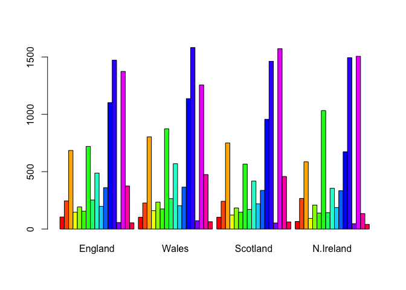

``` r
#make the same barplot, but stacked
barplot(as.matrix(x), beside=F, col=rainbow(nrow(x)))
```

 Q3: Changing what optional argument in the above barplot() function results in the following plot? beside=F

``` r
pairs(x, col=rainbow(10), pch=16)
```

 Q5: Generating all pairwise plots may help somewhat. Can you make sense of the following code and resulting figure? What does it mean if a given point lies on the diagonal for a given plot? It means both countries eat roughly the same amount of that food.

Q6. What is the main differences between N. Ireland and the other countries of the UK in terms of this data-set? It looks like N. Ireland eats more dark blue and less orange

PCA part
--------

``` r
pca <- prcomp( t(x) )
summary(pca)
```

    ## Importance of components:
    ##                             PC1      PC2      PC3       PC4
    ## Standard deviation     324.1502 212.7478 73.87622 4.189e-14
    ## Proportion of Variance   0.6744   0.2905  0.03503 0.000e+00
    ## Cumulative Proportion    0.6744   0.9650  1.00000 1.000e+00

Q7. Complete the code below to generate a plot of PC1 vs PC2. The second line adds text labels over the data points.

``` r
# Plot PC1 vs PC2
plot(pca$x[,1], pca$x[,2], xlab="PC1", ylab="PC2", xlim=c(-270,500))
text(pca$x[,1], pca$x[,2], colnames(x),col=c("yellow","red","blue","green"))
```

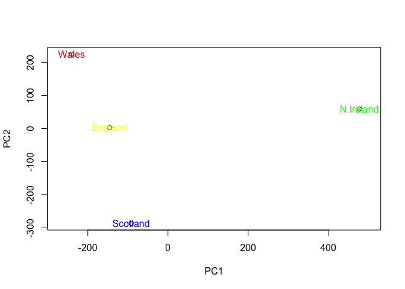

Calculate the variation each PC accounts for

``` r
v <- round( pca$sdev^2/sum(pca$sdev^2) * 100 )
v
```

    ## [1] 67 29  4  0

``` r
#above is the same as the second row of this:
z <- summary(pca)
z$importance
```

    ##                              PC1       PC2      PC3          PC4
    ## Standard deviation     324.15019 212.74780 73.87622 4.188568e-14
    ## Proportion of Variance   0.67444   0.29052  0.03503 0.000000e+00
    ## Cumulative Proportion    0.67444   0.96497  1.00000 1.000000e+00

Make a scree plot

``` r
barplot(v, xlab="Principal Component", ylab="Percent Variation")
```


PC1 Loading scores

``` r
par(mar=c(10, 3, 0.35, 0))
barplot( pca$rotation[,1], las=2 )
```

 PC2 Loading Scores

``` r
par(mar=c(10, 3, 0.35, 0))
barplot( pca$rotation[,2], las=2 )
```

 Q9: Generate a similar ‘loadings plot’ for PC2. What two food groups feature prominantely and what does PC2 maninly tell us about? The predominant foods are potatoes and soft drinks.

``` r
biplot(pca)
```


