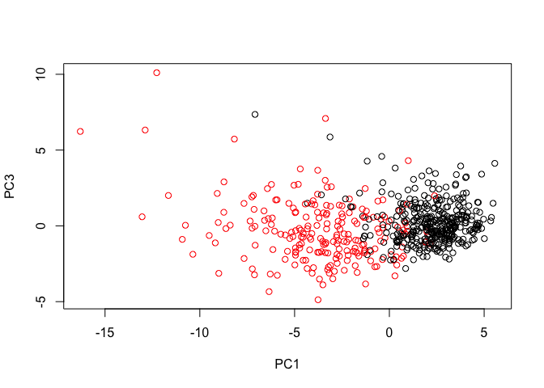
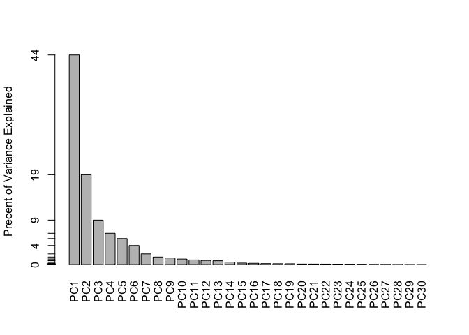

5T
================
Kalyani Cauwenberghs
10/29/2019

`This is verbatim font.`

### Unsupervised Learning Mini-Project

1. Exploratory data analysis
----------------------------

``` r
# Save your input data file to a new 'data' directory
fna.data <- "data/WisconsinCancer.csv"

# Complete the following code to input the data and store as wisc.df
wisc.df <- read.csv("data/WisconsinCancer.csv")
#convert to matrix
wisc.data <- as.matrix(wisc.df)
# Set the row names of wisc.data
row.names(wisc.data) <- wisc.df$id
#create diagnosis vector
diagnosis <-wisc.df$diagnosis
```

We will now exclude id and diagnosis from our data set.

Q1. How many observations are in this dataset? In the data frame, we have 569 samples.

Q2. How many of the observations have a malignant diagnosis?

``` r
a<-table(wisc.df$diagnosis)
a
```

    ## 
    ##   B   M 
    ## 357 212

212 observations are malignant.

Q3. How many variables/features in the data are suffixed with `_mean`?

``` r
#returns the column indices
x<-grep("_mean$",colnames(wisc.df))
#returns the column names
x<-grep("_mean$",colnames(wisc.df),value = T)

length(x)
```

    ## [1] 10

2. Principal Component Analysis
-------------------------------

``` r
#exclude some columns of the data frame, convert to matrix
wisc.df <- subset(wisc.df, select = -c(id, diagnosis,X))
wisc.data <- as.matrix(wisc.df)

# Check column means and standard deviations, round to 3 decimal places
round(colMeans(wisc.data), 3)
```

    ##             radius_mean            texture_mean          perimeter_mean 
    ##                  14.127                  19.290                  91.969 
    ##               area_mean         smoothness_mean        compactness_mean 
    ##                 654.889                   0.096                   0.104 
    ##          concavity_mean     concave.points_mean           symmetry_mean 
    ##                   0.089                   0.049                   0.181 
    ##  fractal_dimension_mean               radius_se              texture_se 
    ##                   0.063                   0.405                   1.217 
    ##            perimeter_se                 area_se           smoothness_se 
    ##                   2.866                  40.337                   0.007 
    ##          compactness_se            concavity_se       concave.points_se 
    ##                   0.025                   0.032                   0.012 
    ##             symmetry_se    fractal_dimension_se            radius_worst 
    ##                   0.021                   0.004                  16.269 
    ##           texture_worst         perimeter_worst              area_worst 
    ##                  25.677                 107.261                 880.583 
    ##        smoothness_worst       compactness_worst         concavity_worst 
    ##                   0.132                   0.254                   0.272 
    ##    concave.points_worst          symmetry_worst fractal_dimension_worst 
    ##                   0.115                   0.290                   0.084

``` r
round( apply(wisc.data,2,sd), 3 )
```

    ##             radius_mean            texture_mean          perimeter_mean 
    ##                   3.524                   4.301                  24.299 
    ##               area_mean         smoothness_mean        compactness_mean 
    ##                 351.914                   0.014                   0.053 
    ##          concavity_mean     concave.points_mean           symmetry_mean 
    ##                   0.080                   0.039                   0.027 
    ##  fractal_dimension_mean               radius_se              texture_se 
    ##                   0.007                   0.277                   0.552 
    ##            perimeter_se                 area_se           smoothness_se 
    ##                   2.022                  45.491                   0.003 
    ##          compactness_se            concavity_se       concave.points_se 
    ##                   0.018                   0.030                   0.006 
    ##             symmetry_se    fractal_dimension_se            radius_worst 
    ##                   0.008                   0.003                   4.833 
    ##           texture_worst         perimeter_worst              area_worst 
    ##                   6.146                  33.603                 569.357 
    ##        smoothness_worst       compactness_worst         concavity_worst 
    ##                   0.023                   0.157                   0.209 
    ##    concave.points_worst          symmetry_worst fractal_dimension_worst 
    ##                   0.066                   0.062                   0.018

Because the values are different from one another, we will use `scale=T` when performing PCA.

``` r
wisc.pr <- prcomp(wisc.data,scale=T)
t<-summary(wisc.pr)
t
```

    ## Importance of components:
    ##                           PC1    PC2     PC3     PC4     PC5     PC6     PC7
    ## Standard deviation     3.6444 2.3857 1.67867 1.40735 1.28403 1.09880 0.82172
    ## Proportion of Variance 0.4427 0.1897 0.09393 0.06602 0.05496 0.04025 0.02251
    ## Cumulative Proportion  0.4427 0.6324 0.72636 0.79239 0.84734 0.88759 0.91010
    ##                            PC8    PC9    PC10   PC11    PC12    PC13    PC14
    ## Standard deviation     0.69037 0.6457 0.59219 0.5421 0.51104 0.49128 0.39624
    ## Proportion of Variance 0.01589 0.0139 0.01169 0.0098 0.00871 0.00805 0.00523
    ## Cumulative Proportion  0.92598 0.9399 0.95157 0.9614 0.97007 0.97812 0.98335
    ##                           PC15    PC16    PC17    PC18    PC19    PC20   PC21
    ## Standard deviation     0.30681 0.28260 0.24372 0.22939 0.22244 0.17652 0.1731
    ## Proportion of Variance 0.00314 0.00266 0.00198 0.00175 0.00165 0.00104 0.0010
    ## Cumulative Proportion  0.98649 0.98915 0.99113 0.99288 0.99453 0.99557 0.9966
    ##                           PC22    PC23   PC24    PC25    PC26    PC27    PC28
    ## Standard deviation     0.16565 0.15602 0.1344 0.12442 0.09043 0.08307 0.03987
    ## Proportion of Variance 0.00091 0.00081 0.0006 0.00052 0.00027 0.00023 0.00005
    ## Cumulative Proportion  0.99749 0.99830 0.9989 0.99942 0.99969 0.99992 0.99997
    ##                           PC29    PC30
    ## Standard deviation     0.02736 0.01153
    ## Proportion of Variance 0.00002 0.00000
    ## Cumulative Proportion  1.00000 1.00000

``` r
#make a scree plot
plot(wisc.pr)
```


Q4. From your results, what proportion of the original variance is captured by the first principal components (PC1)? 0.44272

Q5. How many principal components (PCs) are required to describe at least 70% of the original variance in the data?

``` r
which(t$importance[3,] > 0.7)[1]
```

    ## PC3 
    ##   3

Q6. How many principal components (PCs) are required to describe at least 90% of the original variance in the data?

``` r
which(t$importance[3,] > 0.9)[1]
```

    ## PC7 
    ##   7

``` r
biplot(wisc.pr)
```

 Q7. What stands out to you about this plot? Is it easy or difficult to understand? Why?

The ont thing that stands out the most is that fractal\_dimension\_mean is near the bottom. It is difficult to understand because all the words are crowded together.

``` r
#Plot PC 1 and 2, color by diagnosis
plot(wisc.pr$x[,1],wisc.pr$x[,2],col=diagnosis,xlab="PC1",ylab="PC2")
```


Q8. Generate a similar plot for principal components 1 and 3. What do you notice about these plots?

The red and black dots are a bit more merged in the same space, but still form distinct groups.

``` r
#Plot PC 1 and 3, color by diagnosis
plot(wisc.pr$x[,1],wisc.pr$x[,3],col=diagnosis,xlab="PC1",ylab="PC3")
```



``` r
# Calculate variance of each component
eigenvalues <- wisc.pr$sdev^2
wisc.pr.matrix<-rbind(variance = eigenvalues,
  prop_variance = eigenvalues/sum(eigenvalues),
  cum_variance = cumsum(eigenvalues)/sum(eigenvalues))
pr.var <- wisc.pr.matrix["variance",]
head(pr.var)
```

    ## [1] 13.281608  5.691355  2.817949  1.980640  1.648731  1.207357

``` r
# Variance explained by each principal component: pve
pve<-wisc.pr.matrix["prop_variance",]

# Plot variance explained for each principal component
plot(pve, xlab = "Principal Component", 
     ylab = "Proportion of Variance Explained", 
     ylim = c(0, 1), type = "o")
```


``` r
# Alternative scree plot of the same data, note data driven y-axis
barplot(pve, ylab = "Precent of Variance Explained",
     names.arg=paste0("PC",1:length(pve)), las=2, axes = FALSE)
axis(2, at=pve, labels=round(pve,2)*100 )
```



``` r
## ggplot based graph
#install.packages("factoextra")
library(factoextra)
```

    ## Loading required package: ggplot2

    ## Welcome! Want to learn more? See two factoextra-related books at https://goo.gl/ve3WBa

``` r
fviz_eig(wisc.pr, addlabels = TRUE)
```


Q9. For the first principal component, what is the component of the loading vector (i.e. wisc.pr$rotation\[,1\]) for the feature concave.points\_mean? TODO???

Q10. What is the minimum number of principal components required to explain 80% of the variance of the data? TODO see above. The minimum number of principal components required to explain 80% of the variance of the datais 0.4427203, 0.6324321, 0.7263637, 0.7923851, 0.8473427, 0.887588, 0.9100953, 0.9259825, 0.939879, 0.9515688, 0.961366, 0.9700714, 0.9781166, 0.9833503, 0.9864881, 0.9891502, 0.9911302, 0.9928841, 0.9945334, 0.995572, 0.9965711, 0.9974858, 0.9982971, 0.998899, 0.999415, 0.9996876, 0.9999176, 0.9999706, 0.9999956, 1

3. Hierarchical clustering
--------------------------

``` r
#scale data
data.scaled <- scale(wisc.data)
#calculate euclidean distances between all pairs of observations
data.dist <- dist(data.scaled,method = "euclidean")
#create a hierarchical clustering model using complete linkage
wisc.hclust <-hclust(data.dist,method="complete")
```

Q11. Using the plot() and abline() functions, what is the height at which the clustering model has 4 clusters? TODO

``` r
plot(wisc.hclust)
```


``` r
#abline(h=4,col="red", lty=2) TODO fix
```

``` r
#divide clusters into 4 groups
wisc.hclust.clusters <- cutree(wisc.hclust,k=4)

table(wisc.hclust.clusters, diagnosis)
```

    ##                     diagnosis
    ## wisc.hclust.clusters   B   M
    ##                    1  12 165
    ##                    2   2   5
    ##                    3 343  40
    ##                    4   0   2

Q12. Can you find a better cluster vs diagnoses match with by cutting into a different number of clusters between 2 and 10?

``` r
#divide clusters into 4 groups
wisc.hclust.clusters <- cutree(wisc.hclust,k=4)

table(wisc.hclust.clusters, diagnosis)
```

    ##                     diagnosis
    ## wisc.hclust.clusters   B   M
    ##                    1  12 165
    ##                    2   2   5
    ##                    3 343  40
    ##                    4   0   2

4. OPTIONAL: K-means clustering
-------------------------------

``` r
data.scaled <- scale(wisc.data)
wisc.km <- kmeans(data.scaled, centers=2, nstart=20)
#create a table
table(wisc.km$cluster,diagnosis)
```

    ##    diagnosis
    ##       B   M
    ##   1 343  37
    ##   2  14 175

Q13. How well does k-means separate the two diagnoses? How does it compare to your hclust results?

``` r
table(wisc.km$cluster,wisc.hclust.clusters)
```

    ##    wisc.hclust.clusters
    ##       1   2   3   4
    ##   1  17   0 363   0
    ##   2 160   7  20   2

5. Combining methods
--------------------

``` r
# Use the distance along the first 7 PCs for clustering i.e. wisc.pr$x[, 1:7]
#wisc.pr.hclust <- hclust(wisc.pr$x[, 1:7], method="ward.D2")
#cut into 2 clusters
#wisc.pr.hclust.clusters <- cutree(wisc.pr.hclust, k=2)
```

``` r
#grps <- cutree(wisc.pr.hclust, k=2)
#table(grps)

#table(grps, diagnosis)

#plot(wisc.pr$x[,1:2], col=grps)

#plot(wisc.pr$x[,1:2], col=diagnosis)

#g <- as.factor(grps)
#levels(g)

#g <- relevel(g,2)
#levels(g)

# Plot using our re-ordered factor 
#plot(wisc.pr$x[,1:2], col=g)

#install.packages("rgl")
#library(rgl)
#plot3d(wisc.pr$x[,1:3], xlab="PC 1", ylab="PC 2", zlab="PC 3", cex=1.5, size=1, type="s", col=grps)
#for html output
#rglwidget(width = 400, height = 400)
```

Bookmark: <https://bioboot.github.io/bimm143_F19/class-material/lab-9-bimm143.html#6_sensitivityspecificity>
