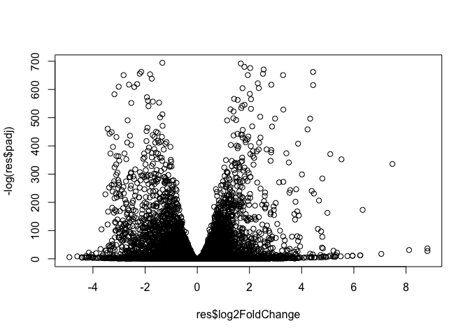
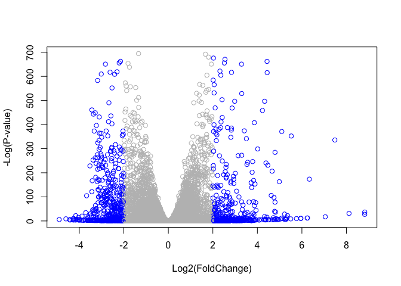

7Th
================

Section 1. Differential Expression Analysis
-------------------------------------------

``` r
library(DESeq2)
```

    ## Loading required package: S4Vectors

    ## Loading required package: stats4

    ## Loading required package: BiocGenerics

    ## Loading required package: parallel

    ## 
    ## Attaching package: 'BiocGenerics'

    ## The following objects are masked from 'package:parallel':
    ## 
    ##     clusterApply, clusterApplyLB, clusterCall, clusterEvalQ,
    ##     clusterExport, clusterMap, parApply, parCapply, parLapply,
    ##     parLapplyLB, parRapply, parSapply, parSapplyLB

    ## The following objects are masked from 'package:stats':
    ## 
    ##     IQR, mad, sd, var, xtabs

    ## The following objects are masked from 'package:base':
    ## 
    ##     anyDuplicated, append, as.data.frame, basename, cbind, colnames,
    ##     dirname, do.call, duplicated, eval, evalq, Filter, Find, get, grep,
    ##     grepl, intersect, is.unsorted, lapply, Map, mapply, match, mget,
    ##     order, paste, pmax, pmax.int, pmin, pmin.int, Position, rank,
    ##     rbind, Reduce, rownames, sapply, setdiff, sort, table, tapply,
    ##     union, unique, unsplit, which, which.max, which.min

    ## 
    ## Attaching package: 'S4Vectors'

    ## The following object is masked from 'package:base':
    ## 
    ##     expand.grid

    ## Loading required package: IRanges

    ## Loading required package: GenomicRanges

    ## Loading required package: GenomeInfoDb

    ## Loading required package: SummarizedExperiment

    ## Loading required package: Biobase

    ## Welcome to Bioconductor
    ## 
    ##     Vignettes contain introductory material; view with
    ##     'browseVignettes()'. To cite Bioconductor, see
    ##     'citation("Biobase")', and for packages 'citation("pkgname")'.

    ## Loading required package: DelayedArray

    ## Loading required package: matrixStats

    ## 
    ## Attaching package: 'matrixStats'

    ## The following objects are masked from 'package:Biobase':
    ## 
    ##     anyMissing, rowMedians

    ## Loading required package: BiocParallel

    ## 
    ## Attaching package: 'DelayedArray'

    ## The following objects are masked from 'package:matrixStats':
    ## 
    ##     colMaxs, colMins, colRanges, rowMaxs, rowMins, rowRanges

    ## The following objects are masked from 'package:base':
    ## 
    ##     aperm, apply, rowsum

``` r
colData <- read.csv("GSE37704_metadata.csv", row.names=1)
countData <- read.csv("GSE37704_featurecounts.csv", row.names=1)
# Note we need to remove the odd first $length col for deSEQ2
countData <- as.matrix(countData[,-1])
head(countData)
```

    ##                 SRR493366 SRR493367 SRR493368 SRR493369 SRR493370 SRR493371
    ## ENSG00000186092         0         0         0         0         0         0
    ## ENSG00000279928         0         0         0         0         0         0
    ## ENSG00000279457        23        28        29        29        28        46
    ## ENSG00000278566         0         0         0         0         0         0
    ## ENSG00000273547         0         0         0         0         0         0
    ## ENSG00000187634       124       123       205       207       212       258

Double checkthat colnames of countData without length column are the same as rownames of colData

``` r
#check if all entries in a vector are true
all(colnames(countData)==rownames(colData))
```

    ## [1] TRUE

Remove any genes (rows) that have 0 for all experiments (cols)

``` r
sumcol <- countData %*% (as.matrix(rep(1,ncol(countData))))
keep_rows<-which(sumcol!=0)
countData <- as.matrix(countData[keep_rows,])
```

Perform diff. exp. analysis

``` r
dds <- DESeqDataSetFromMatrix(countData=countData,
                             colData=colData,
                             design=~condition)
dds <- DESeq(dds)
```

    ## estimating size factors

    ## estimating dispersions

    ## gene-wise dispersion estimates

    ## mean-dispersion relationship

    ## final dispersion estimates

    ## fitting model and testing

get results

``` r
res <- results(dds)
res
```

    ## log2 fold change (MLE): condition hoxa1 kd vs control sirna 
    ## Wald test p-value: condition hoxa1 kd vs control sirna 
    ## DataFrame with 15975 rows and 6 columns
    ##                         baseMean     log2FoldChange              lfcSE
    ##                        <numeric>          <numeric>          <numeric>
    ## ENSG00000279457 29.9135794276176  0.179257083672691  0.324821565250145
    ## ENSG00000187634 183.229649921658   0.42645711840331  0.140265820376891
    ## ENSG00000188976 1651.18807619944 -0.692720464846371 0.0548465415913881
    ## ENSG00000187961 209.637938486147  0.729755610585229  0.131859899969346
    ## ENSG00000187583 47.2551232589398 0.0405765278756319  0.271892808601774
    ## ...                          ...                ...                ...
    ## ENSG00000273748 35.3026523877463  0.674387102558607  0.303666187454138
    ## ENSG00000278817 2.42302393023632 -0.388988266500022   1.13039377720312
    ## ENSG00000278384 1.10179649846993  0.332990658240633    1.6602614216556
    ## ENSG00000276345 73.6449563127136 -0.356180759105173  0.207715658398249
    ## ENSG00000271254 181.595902546813 -0.609666545167283   0.14132048280351
    ##                               stat               pvalue                 padj
    ##                          <numeric>            <numeric>            <numeric>
    ## ENSG00000279457  0.551863246932652    0.581042050747029    0.686554777832896
    ## ENSG00000187634   3.04034951107426  0.00236303749730955  0.00515718149494272
    ## ENSG00000188976  -12.6301576133497  1.4398954015367e-36 1.76548905389749e-35
    ## ENSG00000187961   5.53432552849562 3.12428248077692e-08 1.13412993107612e-07
    ## ENSG00000187583   0.14923722361139    0.881366448669145    0.919030615571379
    ## ...                            ...                  ...                  ...
    ## ENSG00000273748   2.22081723425483   0.0263633428047813   0.0479091179108343
    ## ENSG00000278817 -0.344117487502873    0.730757932009184    0.809772069001613
    ## ENSG00000278384  0.200565196478864    0.841038574220432    0.892653531513564
    ## ENSG00000276345  -1.71475160732599   0.0863907773559419    0.139761501281215
    ## ENSG00000271254  -4.31407063627822 1.60275699407021e-05 4.53647639304911e-05

``` r
plot(res$log2FoldChange,-log(res$padj))
```

 add color to plot

``` r
#first make everything gray
mycols<-rep("gray",length(res$padj))
#then make everything with extreme fold change blue
mycols[abs(res$log2FoldChange)>2]<-"blue"
plot( res$log2FoldChange, -log(res$padj), col=mycols, xlab="Log2(FoldChange)", ylab="-Log(P-value)" )
```



install packages
================

``` r
#BiocManager::install("AnnotationDbi")
#BiocManager::install("org.Hs.eg.db")
library("AnnotationDbi")
library("org.Hs.eg.db")
```

    ## 

``` r
#can translate between all the following databases:
columns(org.Hs.eg.db)
```

    ##  [1] "ACCNUM"       "ALIAS"        "ENSEMBL"      "ENSEMBLPROT"  "ENSEMBLTRANS"
    ##  [6] "ENTREZID"     "ENZYME"       "EVIDENCE"     "EVIDENCEALL"  "GENENAME"    
    ## [11] "GO"           "GOALL"        "IPI"          "MAP"          "OMIM"        
    ## [16] "ONTOLOGY"     "ONTOLOGYALL"  "PATH"         "PFAM"         "PMID"        
    ## [21] "PROSITE"      "REFSEQ"       "SYMBOL"       "UCSCKG"       "UNIGENE"     
    ## [26] "UNIPROT"

``` r
res$symbol = mapIds(org.Hs.eg.db,
                    keys=row.names(countData), #IDs
                    keytype="ENSEMBL", #ID format
                    column="SYMBOL", #desired format
                    multiVals="first")
```

    ## 'select()' returned 1:many mapping between keys and columns

``` r
res$entrez = mapIds(org.Hs.eg.db,
                    keys=row.names(countData),
                    keytype="ENSEMBL",
                    column="ENTREZID",
                    multiVals="first")
```

    ## 'select()' returned 1:many mapping between keys and columns

``` r
res$name =   mapIds(org.Hs.eg.db,
                    keys=row.names(countData),
                    keytype="ENSEMBL",
                    column="GENENAME",
                    multiVals="first")
```

    ## 'select()' returned 1:many mapping between keys and columns

``` r
head(res$symbol)
```

    ## ENSG00000279457 ENSG00000187634 ENSG00000188976 ENSG00000187961 ENSG00000187583 
    ##              NA        "SAMD11"         "NOC2L"        "KLHL17"       "PLEKHN1" 
    ## ENSG00000187642 
    ##         "PERM1"

``` r
head(res$entrez)
```

    ## ENSG00000279457 ENSG00000187634 ENSG00000188976 ENSG00000187961 ENSG00000187583 
    ##              NA        "148398"         "26155"        "339451"         "84069" 
    ## ENSG00000187642 
    ##         "84808"

``` r
head(res$name)
```

    ##                                            ENSG00000279457 
    ##                                                         NA 
    ##                                            ENSG00000187634 
    ##                 "sterile alpha motif domain containing 11" 
    ##                                            ENSG00000188976 
    ## "NOC2 like nucleolar associated transcriptional repressor" 
    ##                                            ENSG00000187961 
    ##                              "kelch like family member 17" 
    ##                                            ENSG00000187583 
    ##                 "pleckstrin homology domain containing N1" 
    ##                                            ENSG00000187642 
    ##             "PPARGC1 and ESRR induced regulator, muscle 1"

``` r
#write to file, ordered by p-value
res = res[order(res$pvalue),]
write.csv(res, file="deseq_results.csv")
```

Section 2. Pathway Analysis
---------------------------

``` r
#BiocManager::install( c("pathview", "gage", "gageData") )

library("pathview")
```

    ## ##############################################################################
    ## Pathview is an open source software package distributed under GNU General
    ## Public License version 3 (GPLv3). Details of GPLv3 is available at
    ## http://www.gnu.org/licenses/gpl-3.0.html. Particullary, users are required to
    ## formally cite the original Pathview paper (not just mention it) in publications
    ## or products. For details, do citation("pathview") within R.
    ## 
    ## The pathview downloads and uses KEGG data. Non-academic uses may require a KEGG
    ## license agreement (details at http://www.kegg.jp/kegg/legal.html).
    ## ##############################################################################

``` r
library("gage")
library("gageData")
```

``` r
library(gage)
library(gageData)

#load the data sets
#KEGG pathways 
data(kegg.sets.hs)
#signaling and metabolic pathways
data(sigmet.idx.hs)

# Focus on signaling and metabolic pathways only
kegg.sets.hs = kegg.sets.hs[sigmet.idx.hs]

# Examine the first 3 pathways
head(kegg.sets.hs, 3)
```

    ## $`hsa00232 Caffeine metabolism`
    ## [1] "10"   "1544" "1548" "1549" "1553" "7498" "9"   
    ## 
    ## $`hsa00983 Drug metabolism - other enzymes`
    ##  [1] "10"     "1066"   "10720"  "10941"  "151531" "1548"   "1549"   "1551"  
    ##  [9] "1553"   "1576"   "1577"   "1806"   "1807"   "1890"   "221223" "2990"  
    ## [17] "3251"   "3614"   "3615"   "3704"   "51733"  "54490"  "54575"  "54576" 
    ## [25] "54577"  "54578"  "54579"  "54600"  "54657"  "54658"  "54659"  "54963" 
    ## [33] "574537" "64816"  "7083"   "7084"   "7172"   "7363"   "7364"   "7365"  
    ## [41] "7366"   "7367"   "7371"   "7372"   "7378"   "7498"   "79799"  "83549" 
    ## [49] "8824"   "8833"   "9"      "978"   
    ## 
    ## $`hsa00230 Purine metabolism`
    ##   [1] "100"    "10201"  "10606"  "10621"  "10622"  "10623"  "107"    "10714" 
    ##   [9] "108"    "10846"  "109"    "111"    "11128"  "11164"  "112"    "113"   
    ##  [17] "114"    "115"    "122481" "122622" "124583" "132"    "158"    "159"   
    ##  [25] "1633"   "171568" "1716"   "196883" "203"    "204"    "205"    "221823"
    ##  [33] "2272"   "22978"  "23649"  "246721" "25885"  "2618"   "26289"  "270"   
    ##  [41] "271"    "27115"  "272"    "2766"   "2977"   "2982"   "2983"   "2984"  
    ##  [49] "2986"   "2987"   "29922"  "3000"   "30833"  "30834"  "318"    "3251"  
    ##  [57] "353"    "3614"   "3615"   "3704"   "377841" "471"    "4830"   "4831"  
    ##  [65] "4832"   "4833"   "4860"   "4881"   "4882"   "4907"   "50484"  "50940" 
    ##  [73] "51082"  "51251"  "51292"  "5136"   "5137"   "5138"   "5139"   "5140"  
    ##  [81] "5141"   "5142"   "5143"   "5144"   "5145"   "5146"   "5147"   "5148"  
    ##  [89] "5149"   "5150"   "5151"   "5152"   "5153"   "5158"   "5167"   "5169"  
    ##  [97] "51728"  "5198"   "5236"   "5313"   "5315"   "53343"  "54107"  "5422"  
    ## [105] "5424"   "5425"   "5426"   "5427"   "5430"   "5431"   "5432"   "5433"  
    ## [113] "5434"   "5435"   "5436"   "5437"   "5438"   "5439"   "5440"   "5441"  
    ## [121] "5471"   "548644" "55276"  "5557"   "5558"   "55703"  "55811"  "55821" 
    ## [129] "5631"   "5634"   "56655"  "56953"  "56985"  "57804"  "58497"  "6240"  
    ## [137] "6241"   "64425"  "646625" "654364" "661"    "7498"   "8382"   "84172" 
    ## [145] "84265"  "84284"  "84618"  "8622"   "8654"   "87178"  "8833"   "9060"  
    ## [153] "9061"   "93034"  "953"    "9533"   "954"    "955"    "956"    "957"   
    ## [161] "9583"   "9615"

map our gene set to database
============================

``` r
foldchanges = res$log2FoldChange
names(foldchanges) = res$entrez
head(foldchanges)
```

    ##      1266     54855      1465     51232      2034      2317 
    ## -2.422719  3.201955 -2.313738 -2.059631 -1.888019 -1.649792

``` r
# Get the results
keggres = gage(foldchanges, gsets=kegg.sets.hs)
#downregulated pathways
head(keggres$less)
```

    ##                                          p.geomean stat.mean        p.val
    ## hsa04110 Cell cycle                   8.995727e-06 -4.378644 8.995727e-06
    ## hsa03030 DNA replication              9.424076e-05 -3.951803 9.424076e-05
    ## hsa03013 RNA transport                1.375901e-03 -3.028500 1.375901e-03
    ## hsa03440 Homologous recombination     3.066756e-03 -2.852899 3.066756e-03
    ## hsa04114 Oocyte meiosis               3.784520e-03 -2.698128 3.784520e-03
    ## hsa00010 Glycolysis / Gluconeogenesis 8.961413e-03 -2.405398 8.961413e-03
    ##                                             q.val set.size         exp1
    ## hsa04110 Cell cycle                   0.001448312      121 8.995727e-06
    ## hsa03030 DNA replication              0.007586381       36 9.424076e-05
    ## hsa03013 RNA transport                0.073840037      144 1.375901e-03
    ## hsa03440 Homologous recombination     0.121861535       28 3.066756e-03
    ## hsa04114 Oocyte meiosis               0.121861535      102 3.784520e-03
    ## hsa00010 Glycolysis / Gluconeogenesis 0.212222694       53 8.961413e-03

``` r
#make one pathway infographic
pathview(gene.data=foldchanges, pathway.id="hsa04110")


#make more pathway infographics

# A different PDF based output of the same data
pathview(gene.data=foldchanges, pathway.id="hsa04110", kegg.native=FALSE)
## Focus on top 5 upregulated pathways here for demo purposes only
keggrespathways <- rownames(keggres$greater)[1:5]

# Extract the 8 character long IDs part of each string
keggresids = substr(keggrespathways, start=1, stop=8)
keggresids
pathview(gene.data=foldchanges, pathway.id=keggresids, species="hsa")
```

Section 3. Gene Ontology (GO)
-----------------------------

``` r
data(go.sets.hs)
data(go.subs.hs)

# Focus on Biological Process subset of GO
gobpsets = go.sets.hs[go.subs.hs$BP]

gobpres = gage(foldchanges, gsets=gobpsets, same.dir=TRUE)

lapply(gobpres, head)
```

    ## $greater
    ##                                              p.geomean stat.mean        p.val
    ## GO:0007156 homophilic cell adhesion       8.519724e-05  3.824205 8.519724e-05
    ## GO:0002009 morphogenesis of an epithelium 1.396681e-04  3.653886 1.396681e-04
    ## GO:0048729 tissue morphogenesis           1.432451e-04  3.643242 1.432451e-04
    ## GO:0007610 behavior                       2.195494e-04  3.530241 2.195494e-04
    ## GO:0060562 epithelial tube morphogenesis  5.932837e-04  3.261376 5.932837e-04
    ## GO:0035295 tube development               5.953254e-04  3.253665 5.953254e-04
    ##                                               q.val set.size         exp1
    ## GO:0007156 homophilic cell adhesion       0.1952430      113 8.519724e-05
    ## GO:0002009 morphogenesis of an epithelium 0.1952430      339 1.396681e-04
    ## GO:0048729 tissue morphogenesis           0.1952430      424 1.432451e-04
    ## GO:0007610 behavior                       0.2244344      427 2.195494e-04
    ## GO:0060562 epithelial tube morphogenesis  0.3712298      257 5.932837e-04
    ## GO:0035295 tube development               0.3712298      391 5.953254e-04
    ## 
    ## $less
    ##                                             p.geomean stat.mean        p.val
    ## GO:0048285 organelle fission             1.536227e-15 -8.063910 1.536227e-15
    ## GO:0000280 nuclear division              4.286961e-15 -7.939217 4.286961e-15
    ## GO:0007067 mitosis                       4.286961e-15 -7.939217 4.286961e-15
    ## GO:0000087 M phase of mitotic cell cycle 1.169934e-14 -7.797496 1.169934e-14
    ## GO:0007059 chromosome segregation        2.028624e-11 -6.878340 2.028624e-11
    ## GO:0000236 mitotic prometaphase          1.729553e-10 -6.695966 1.729553e-10
    ##                                                 q.val set.size         exp1
    ## GO:0048285 organelle fission             5.843127e-12      376 1.536227e-15
    ## GO:0000280 nuclear division              5.843127e-12      352 4.286961e-15
    ## GO:0007067 mitosis                       5.843127e-12      352 4.286961e-15
    ## GO:0000087 M phase of mitotic cell cycle 1.195965e-11      362 1.169934e-14
    ## GO:0007059 chromosome segregation        1.659009e-08      142 2.028624e-11
    ## GO:0000236 mitotic prometaphase          1.178690e-07       84 1.729553e-10
    ## 
    ## $stats
    ##                                           stat.mean     exp1
    ## GO:0007156 homophilic cell adhesion        3.824205 3.824205
    ## GO:0002009 morphogenesis of an epithelium  3.653886 3.653886
    ## GO:0048729 tissue morphogenesis            3.643242 3.643242
    ## GO:0007610 behavior                        3.530241 3.530241
    ## GO:0060562 epithelial tube morphogenesis   3.261376 3.261376
    ## GO:0035295 tube development                3.253665 3.253665

Section 4. Reactome Analysis
----------------------------

``` r
sig_genes <- res[res$padj <= 0.05 & !is.na(res$padj), "symbol"]
print(paste("Total number of significant genes:", length(sig_genes)))
```

    ## [1] "Total number of significant genes: 8147"

``` r
write.table(sig_genes, file="significant_genes.txt", row.names=FALSE, col.names=FALSE, quote=FALSE)
```
