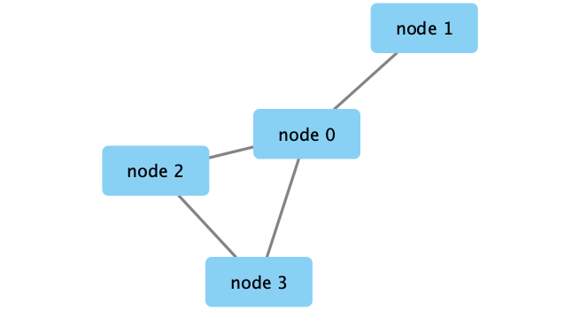
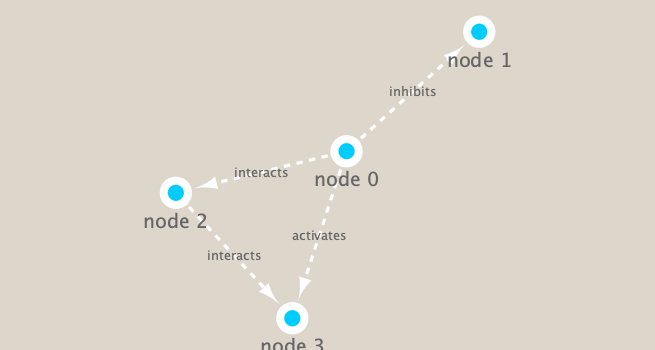

```{r setup, include=FALSE}
knitr::opts_chunk$set(echo = TRUE)
```
##Set up Cytoscape and R connection
```{r eval=FALSE}
BiocManager::install("RCy3")
BiocManager::install("igraph")
BiocManager::install("RColorBrewer")
library(RCy3)
library(igraph)
library(RColorBrewer)
```

```{r}
# Test the connection to Cytoscape.
cytoscapePing()
```

```{r}
g <- makeSimpleIgraph()
createNetworkFromIgraph(g,"myGraph")
```

```{r}
plot(g)
```

export the image
```{r}
fig <- exportImage(filename="demo", type="png", height=350)
#insert into this rmd

```

change style, put in rmd
```{r}
setVisualStyle("Marquee")
fig <- exportImage(filename="demo_marquee", type="png", height=350)


```
##Read our metagenomics data
```{r}
prok_vir_cor <- read.delim("virus_prok_cor_abundant.tsv", stringsAsFactors = FALSE)
head(prok_vir_cor)
```

```{r}
g <- graph.data.frame(prok_vir_cor, directed = FALSE)
class(g)
g
plot(g)

```
Plot different styles
```{r}
plot(g, vertex.label=NA)
```

```{r}
plot(g, vertex.size=3, vertex.label=NA)

```

query vertex attributes
```{r}
V(g)
```

query edge attributes
```{r}
E(g)
```

#detecting network communities
```{r}
cb <- cluster_edge_betweenness(g)
cb
```

```{r}
plot(cb, y=g, vertex.label=NA,  vertex.size=3)
createNetworkFromIgraph(g,"myGraph")
```


```{r}
head( membership(cb) )
```

#get node degree plots
```{r}
# Calculate and plot node degree of our network
d <- degree(g)
hist(d, breaks=30, col="lightblue", main ="Node Degree Distribution")
```


